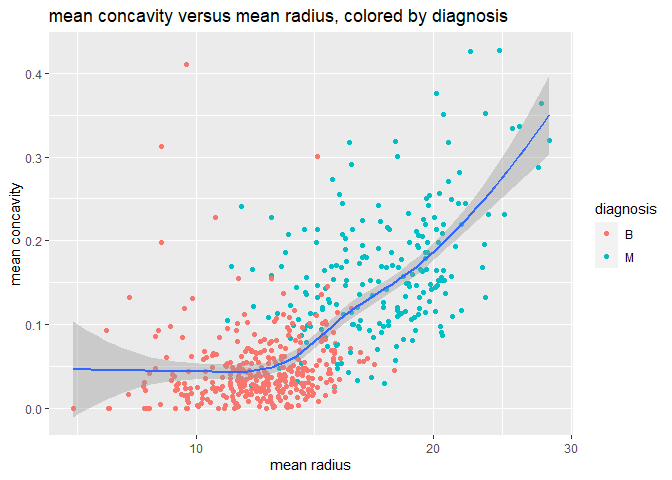

Mini Data-Analysis Deliverable 1
================

# Welcome to your (maybe) first-ever data analysis project!

And hopefully the first of many. Let’s get started:

1.  Install the [`datateachr`](https://github.com/UBC-MDS/datateachr)
    package by typing the following into your **R terminal**:

<!-- -->

    install.packages("devtools")
    devtools::install_github("UBC-MDS/datateachr")

2.  Load the packages below.

``` r
library(datateachr)
library(tidyverse)
```

    ## ── Attaching core tidyverse packages ──────────────────────── tidyverse 2.0.0 ──
    ## ✔ dplyr     1.1.3     ✔ readr     2.1.4
    ## ✔ forcats   1.0.0     ✔ stringr   1.5.0
    ## ✔ ggplot2   3.4.3     ✔ tibble    3.2.1
    ## ✔ lubridate 1.9.2     ✔ tidyr     1.3.0
    ## ✔ purrr     1.0.2     
    ## ── Conflicts ────────────────────────────────────────── tidyverse_conflicts() ──
    ## ✖ dplyr::filter() masks stats::filter()
    ## ✖ dplyr::lag()    masks stats::lag()
    ## ℹ Use the conflicted package (<http://conflicted.r-lib.org/>) to force all conflicts to become errors

3.  Make a repository in the <https://github.com/stat545ubc-2023>
    Organization. You can do this by following the steps found on canvas
    in the entry called [MDA: Create a
    repository](https://canvas.ubc.ca/courses/126199/pages/mda-create-a-repository).
    One completed, your repository should automatically be listed as
    part of the stat545ubc-2023 Organization.

# Instructions

## For Both Milestones

- Each milestone has explicit tasks. Tasks that are more challenging
  will often be allocated more points.

- Each milestone will be also graded for reproducibility, cleanliness,
  and coherence of the overall Github submission.

- While the two milestones will be submitted as independent
  deliverables, the analysis itself is a continuum - think of it as two
  chapters to a story. Each chapter, or in this case, portion of your
  analysis, should be easily followed through by someone unfamiliar with
  the content.
  [Here](https://swcarpentry.github.io/r-novice-inflammation/06-best-practices-R/)
  is a good resource for what constitutes “good code”. Learning good
  coding practices early in your career will save you hassle later on!

- The milestones will be equally weighted.

## For Milestone 1

**To complete this milestone**, edit [this very `.Rmd`
file](https://raw.githubusercontent.com/UBC-STAT/stat545.stat.ubc.ca/master/content/mini-project/mini-project-1.Rmd)
directly. Fill in the sections that are tagged with
`<!--- start your work below --->`.

**To submit this milestone**, make sure to knit this `.Rmd` file to an
`.md` file by changing the YAML output settings from
`output: html_document` to `output: github_document`. Commit and push
all of your work to the mini-analysis GitHub repository you made
earlier, and tag a release on GitHub. Then, submit a link to your tagged
release on canvas.

**Points**: This milestone is worth 36 points: 30 for your analysis, and
6 for overall reproducibility, cleanliness, and coherence of the Github
submission.

# Learning Objectives

By the end of this milestone, you should:

- Become familiar with your dataset of choosing
- Select 4 questions that you would like to answer with your data
- Generate a reproducible and clear report using R Markdown
- Become familiar with manipulating and summarizing your data in tibbles
  using `dplyr`, with a research question in mind.

# Task 1: Choose your favorite dataset

The `datateachr` package by Hayley Boyce and Jordan Bourak currently
composed of 7 semi-tidy datasets for educational purposes. Here is a
brief description of each dataset:

- *apt_buildings*: Acquired courtesy of The City of Toronto’s Open Data
  Portal. It currently has 3455 rows and 37 columns.

- *building_permits*: Acquired courtesy of The City of Vancouver’s Open
  Data Portal. It currently has 20680 rows and 14 columns.

- *cancer_sample*: Acquired courtesy of UCI Machine Learning Repository.
  It currently has 569 rows and 32 columns.

- *flow_sample*: Acquired courtesy of The Government of Canada’s
  Historical Hydrometric Database. It currently has 218 rows and 7
  columns.

- *parking_meters*: Acquired courtesy of The City of Vancouver’s Open
  Data Portal. It currently has 10032 rows and 22 columns.

- *steam_games*: Acquired courtesy of Kaggle. It currently has 40833
  rows and 21 columns.

- *vancouver_trees*: Acquired courtesy of The City of Vancouver’s Open
  Data Portal. It currently has 146611 rows and 20 columns.

**Things to keep in mind**

- We hope that this project will serve as practice for carrying our your
  own *independent* data analysis. Remember to comment your code, be
  explicit about what you are doing, and write notes in this markdown
  document when you feel that context is required. As you advance in the
  project, prompts and hints to do this will be diminished - it’ll be up
  to you!

- Before choosing a dataset, you should always keep in mind **your
  goal**, or in other ways, *what you wish to achieve with this data*.
  This mini data-analysis project focuses on *data wrangling*,
  *tidying*, and *visualization*. In short, it’s a way for you to get
  your feet wet with exploring data on your own.

And that is exactly the first thing that you will do!

1.1 **(1 point)** Out of the 7 datasets available in the `datateachr`
package, choose **4** that appeal to you based on their description.
Write your choices below:

**Note**: We encourage you to use the ones in the `datateachr` package,
but if you have a dataset that you’d really like to use, you can include
it here. But, please check with a member of the teaching team to see
whether the dataset is of appropriate complexity. Also, include a
**brief** description of the dataset here to help the teaching team
understand your data.

<!-------------------------- Start your work below ---------------------------->

I choose: 1: apt_buildings. 2: cancer_sample. 3: parking_meters. 4:
steam_games.

<!----------------------------------------------------------------------------->

1.2 **(6 points)** One way to narrowing down your selection is to
*explore* the datasets. Use your knowledge of dplyr to find out at least
*3* attributes about each of these datasets (an attribute is something
such as number of rows, variables, class type…). The goal here is to
have an idea of *what the data looks like*.

*Hint:* This is one of those times when you should think about the
cleanliness of your analysis. I added a single code chunk for you below,
but do you want to use more than one? Would you like to write more
comments outside of the code chunk?

<!-------------------------- Start your work below ---------------------------->

#### Class attribute of the table

``` r
### EXPLORE HERE ###
###First: look at the classes of four datasets and transform them into tibbles if they are not tibbles.####
class(apt_buildings)
```

    ## [1] "tbl_df"     "tbl"        "data.frame"

``` r
class(cancer_sample)
```

    ## [1] "spec_tbl_df" "tbl_df"      "tbl"         "data.frame"

``` r
class(parking_meters)
```

    ## [1] "tbl_df"     "tbl"        "data.frame"

``` r
class(steam_games)
```

    ## [1] "spec_tbl_df" "tbl_df"      "tbl"         "data.frame"

Class: All datasets are of the class *“tibble”*. *cancer_sample* and
*steam_games* are of subclasses of tibble.

#### Number of rows and variables; Data type of variables

``` r
###Second: take a look at the number of rows and variables. F####
glimpse(apt_buildings) ##have a quick look at the dataset
```

    ## Rows: 3,455
    ## Columns: 37
    ## $ id                               <dbl> 10359, 10360, 10361, 10362, 10363, 10…
    ## $ air_conditioning                 <chr> "NONE", "NONE", "NONE", "NONE", "NONE…
    ## $ amenities                        <chr> "Outdoor rec facilities", "Outdoor po…
    ## $ balconies                        <chr> "YES", "YES", "YES", "YES", "NO", "NO…
    ## $ barrier_free_accessibilty_entr   <chr> "YES", "NO", "NO", "YES", "NO", "NO",…
    ## $ bike_parking                     <chr> "0 indoor parking spots and 10 outdoo…
    ## $ exterior_fire_escape             <chr> "NO", "NO", "NO", "YES", "NO", NA, "N…
    ## $ fire_alarm                       <chr> "YES", "YES", "YES", "YES", "YES", "Y…
    ## $ garbage_chutes                   <chr> "YES", "YES", "NO", "NO", "NO", "NO",…
    ## $ heating_type                     <chr> "HOT WATER", "HOT WATER", "HOT WATER"…
    ## $ intercom                         <chr> "YES", "YES", "YES", "YES", "YES", "Y…
    ## $ laundry_room                     <chr> "YES", "YES", "YES", "YES", "YES", "Y…
    ## $ locker_or_storage_room           <chr> "NO", "YES", "YES", "YES", "NO", "YES…
    ## $ no_of_elevators                  <dbl> 3, 3, 0, 1, 0, 0, 0, 2, 4, 2, 0, 2, 2…
    ## $ parking_type                     <chr> "Underground Garage , Garage accessib…
    ## $ pets_allowed                     <chr> "YES", "YES", "YES", "YES", "YES", "Y…
    ## $ prop_management_company_name     <chr> NA, "SCHICKEDANZ BROS. PROPERTIES", N…
    ## $ property_type                    <chr> "PRIVATE", "PRIVATE", "PRIVATE", "PRI…
    ## $ rsn                              <dbl> 4154812, 4154815, 4155295, 4155309, 4…
    ## $ separate_gas_meters              <chr> "NO", "NO", "NO", "NO", "NO", "NO", "…
    ## $ separate_hydro_meters            <chr> "YES", "YES", "YES", "YES", "YES", "Y…
    ## $ separate_water_meters            <chr> "NO", "NO", "NO", "NO", "NO", "NO", "…
    ## $ site_address                     <chr> "65  FOREST MANOR RD", "70  CLIPPER R…
    ## $ sprinkler_system                 <chr> "YES", "YES", "NO", "YES", "NO", "NO"…
    ## $ visitor_parking                  <chr> "PAID", "FREE", "UNAVAILABLE", "UNAVA…
    ## $ ward                             <chr> "17", "17", "03", "03", "02", "02", "…
    ## $ window_type                      <chr> "DOUBLE PANE", "DOUBLE PANE", "DOUBLE…
    ## $ year_built                       <dbl> 1967, 1970, 1927, 1959, 1943, 1952, 1…
    ## $ year_registered                  <dbl> 2017, 2017, 2017, 2017, 2017, NA, 201…
    ## $ no_of_storeys                    <dbl> 17, 14, 4, 5, 4, 4, 4, 7, 32, 4, 4, 7…
    ## $ emergency_power                  <chr> "NO", "YES", "NO", "NO", "NO", "NO", …
    ## $ `non-smoking_building`           <chr> "YES", "NO", "YES", "YES", "YES", "NO…
    ## $ no_of_units                      <dbl> 218, 206, 34, 42, 25, 34, 14, 105, 57…
    ## $ no_of_accessible_parking_spaces  <dbl> 8, 10, 20, 42, 12, 0, 5, 1, 1, 6, 12,…
    ## $ facilities_available             <chr> "Recycling bins", "Green Bin / Organi…
    ## $ cooling_room                     <chr> "NO", "NO", "NO", "NO", "NO", "NO", "…
    ## $ no_barrier_free_accessible_units <dbl> 2, 0, 0, 42, 0, NA, 14, 0, 0, 1, 25, …

The *apt_buildings* has 3,455 rows and 37 variables. Most of the
variables are string/characters but “id”, “no_of_elevators”, “rsn”,
“year_built”, “year_registered”, “no_of_storeys”, “no_of_units”,
“no_of_accessible_parking_spaces”, and
“no_barrier_free_accessible_units” are numbers.

``` r
glimpse(cancer_sample) ##have a quick look at the dataset
```

    ## Rows: 569
    ## Columns: 32
    ## $ ID                      <dbl> 842302, 842517, 84300903, 84348301, 84358402, …
    ## $ diagnosis               <chr> "M", "M", "M", "M", "M", "M", "M", "M", "M", "…
    ## $ radius_mean             <dbl> 17.990, 20.570, 19.690, 11.420, 20.290, 12.450…
    ## $ texture_mean            <dbl> 10.38, 17.77, 21.25, 20.38, 14.34, 15.70, 19.9…
    ## $ perimeter_mean          <dbl> 122.80, 132.90, 130.00, 77.58, 135.10, 82.57, …
    ## $ area_mean               <dbl> 1001.0, 1326.0, 1203.0, 386.1, 1297.0, 477.1, …
    ## $ smoothness_mean         <dbl> 0.11840, 0.08474, 0.10960, 0.14250, 0.10030, 0…
    ## $ compactness_mean        <dbl> 0.27760, 0.07864, 0.15990, 0.28390, 0.13280, 0…
    ## $ concavity_mean          <dbl> 0.30010, 0.08690, 0.19740, 0.24140, 0.19800, 0…
    ## $ concave_points_mean     <dbl> 0.14710, 0.07017, 0.12790, 0.10520, 0.10430, 0…
    ## $ symmetry_mean           <dbl> 0.2419, 0.1812, 0.2069, 0.2597, 0.1809, 0.2087…
    ## $ fractal_dimension_mean  <dbl> 0.07871, 0.05667, 0.05999, 0.09744, 0.05883, 0…
    ## $ radius_se               <dbl> 1.0950, 0.5435, 0.7456, 0.4956, 0.7572, 0.3345…
    ## $ texture_se              <dbl> 0.9053, 0.7339, 0.7869, 1.1560, 0.7813, 0.8902…
    ## $ perimeter_se            <dbl> 8.589, 3.398, 4.585, 3.445, 5.438, 2.217, 3.18…
    ## $ area_se                 <dbl> 153.40, 74.08, 94.03, 27.23, 94.44, 27.19, 53.…
    ## $ smoothness_se           <dbl> 0.006399, 0.005225, 0.006150, 0.009110, 0.0114…
    ## $ compactness_se          <dbl> 0.049040, 0.013080, 0.040060, 0.074580, 0.0246…
    ## $ concavity_se            <dbl> 0.05373, 0.01860, 0.03832, 0.05661, 0.05688, 0…
    ## $ concave_points_se       <dbl> 0.015870, 0.013400, 0.020580, 0.018670, 0.0188…
    ## $ symmetry_se             <dbl> 0.03003, 0.01389, 0.02250, 0.05963, 0.01756, 0…
    ## $ fractal_dimension_se    <dbl> 0.006193, 0.003532, 0.004571, 0.009208, 0.0051…
    ## $ radius_worst            <dbl> 25.38, 24.99, 23.57, 14.91, 22.54, 15.47, 22.8…
    ## $ texture_worst           <dbl> 17.33, 23.41, 25.53, 26.50, 16.67, 23.75, 27.6…
    ## $ perimeter_worst         <dbl> 184.60, 158.80, 152.50, 98.87, 152.20, 103.40,…
    ## $ area_worst              <dbl> 2019.0, 1956.0, 1709.0, 567.7, 1575.0, 741.6, …
    ## $ smoothness_worst        <dbl> 0.1622, 0.1238, 0.1444, 0.2098, 0.1374, 0.1791…
    ## $ compactness_worst       <dbl> 0.6656, 0.1866, 0.4245, 0.8663, 0.2050, 0.5249…
    ## $ concavity_worst         <dbl> 0.71190, 0.24160, 0.45040, 0.68690, 0.40000, 0…
    ## $ concave_points_worst    <dbl> 0.26540, 0.18600, 0.24300, 0.25750, 0.16250, 0…
    ## $ symmetry_worst          <dbl> 0.4601, 0.2750, 0.3613, 0.6638, 0.2364, 0.3985…
    ## $ fractal_dimension_worst <dbl> 0.11890, 0.08902, 0.08758, 0.17300, 0.07678, 0…

The *cancer_sample* has 569 rows and 32 variables. Most of the variables
are numbers. Only “diagnosis” is string/characters.

``` r
glimpse(parking_meters)
```

    ## Rows: 10,032
    ## Columns: 22
    ## $ meter_head     <chr> "Twin", "Pay Station", "Twin", "Single", "Twin", "Twin"…
    ## $ r_mf_9a_6p     <chr> "$2.00", "$1.00", "$1.00", "$1.00", "$2.00", "$2.00", "…
    ## $ r_mf_6p_10     <chr> "$4.00", "$1.00", "$1.00", "$1.00", "$1.00", "$1.00", "…
    ## $ r_sa_9a_6p     <chr> "$2.00", "$1.00", "$1.00", "$1.00", "$2.00", "$2.00", "…
    ## $ r_sa_6p_10     <chr> "$4.00", "$1.00", "$1.00", "$1.00", "$1.00", "$1.00", "…
    ## $ r_su_9a_6p     <chr> "$2.00", "$1.00", "$1.00", "$1.00", "$2.00", "$2.00", "…
    ## $ r_su_6p_10     <chr> "$4.00", "$1.00", "$1.00", "$1.00", "$1.00", "$1.00", "…
    ## $ rate_misc      <chr> NA, "$ .50", NA, NA, NA, NA, NA, NA, NA, NA, NA, NA, NA…
    ## $ time_in_effect <chr> "METER IN EFFECT: 9:00 AM TO 10:00 PM", "METER IN EFFEC…
    ## $ t_mf_9a_6p     <chr> "2 Hr", "10 Hrs", "2 Hr", "2 Hr", "2 Hr", "3 Hr", "2 Hr…
    ## $ t_mf_6p_10     <chr> "4 Hr", "10 Hrs", "4 Hr", "4 Hr", "4 Hr", "4 Hr", "4 Hr…
    ## $ t_sa_9a_6p     <chr> "2 Hr", "10 Hrs", "2 Hr", "2 Hr", "2 Hr", "3 Hr", "2 Hr…
    ## $ t_sa_6p_10     <chr> "4 Hr", "10 Hrs", "4 Hr", "4 Hr", "4 Hr", "4 Hr", "4 Hr…
    ## $ t_su_9a_6p     <chr> "2 Hr", "10 Hrs", "2 Hr", "2 Hr", "2 Hr", "3 Hr", "2 Hr…
    ## $ t_su_6p_10     <chr> "4 Hr", "10 Hrs", "4 Hr", "4 Hr", "4 Hr", "4 Hr", "4 Hr…
    ## $ time_misc      <chr> NA, "No Time Limit", NA, NA, NA, NA, NA, NA, NA, NA, NA…
    ## $ credit_card    <chr> "No", "Yes", "No", "No", "No", "No", "No", "No", "No", …
    ## $ pay_phone      <chr> "66890", "59916", "57042", "57159", "51104", "60868", "…
    ## $ longitude      <dbl> -123.1289, -123.0982, -123.1013, -123.1862, -123.1278, …
    ## $ latitude       <dbl> 49.28690, 49.27215, 49.25468, 49.26341, 49.26354, 49.27…
    ## $ geo_local_area <chr> "West End", "Strathcona", "Riley Park", "West Point Gre…
    ## $ meter_id       <chr> "670805", "471405", "C80145", "D03704", "301023", "5913…

The *parking_meters* has 10032 rows and 22 variables. Only “longitude”
and “latitude” are numbers, the rest are string/characters.

``` r
glimpse(steam_games) ##have a quick look at the dataset
```

    ## Rows: 40,833
    ## Columns: 21
    ## $ id                       <dbl> 1, 2, 3, 4, 5, 6, 7, 8, 9, 10, 11, 12, 13, 14…
    ## $ url                      <chr> "https://store.steampowered.com/app/379720/DO…
    ## $ types                    <chr> "app", "app", "app", "app", "app", "bundle", …
    ## $ name                     <chr> "DOOM", "PLAYERUNKNOWN'S BATTLEGROUNDS", "BAT…
    ## $ desc_snippet             <chr> "Now includes all three premium DLC packs (Un…
    ## $ recent_reviews           <chr> "Very Positive,(554),- 89% of the 554 user re…
    ## $ all_reviews              <chr> "Very Positive,(42,550),- 92% of the 42,550 u…
    ## $ release_date             <chr> "May 12, 2016", "Dec 21, 2017", "Apr 24, 2018…
    ## $ developer                <chr> "id Software", "PUBG Corporation", "Harebrain…
    ## $ publisher                <chr> "Bethesda Softworks,Bethesda Softworks", "PUB…
    ## $ popular_tags             <chr> "FPS,Gore,Action,Demons,Shooter,First-Person,…
    ## $ game_details             <chr> "Single-player,Multi-player,Co-op,Steam Achie…
    ## $ languages                <chr> "English,French,Italian,German,Spanish - Spai…
    ## $ achievements             <dbl> 54, 37, 128, NA, NA, NA, 51, 55, 34, 43, 72, …
    ## $ genre                    <chr> "Action", "Action,Adventure,Massively Multipl…
    ## $ game_description         <chr> "About This Game Developed by id software, th…
    ## $ mature_content           <chr> NA, "Mature Content Description  The develope…
    ## $ minimum_requirements     <chr> "Minimum:,OS:,Windows 7/8.1/10 (64-bit versio…
    ## $ recommended_requirements <chr> "Recommended:,OS:,Windows 7/8.1/10 (64-bit ve…
    ## $ original_price           <dbl> 19.99, 29.99, 39.99, 44.99, 0.00, NA, 59.99, …
    ## $ discount_price           <dbl> 14.99, NA, NA, NA, NA, 35.18, 70.42, 17.58, N…

The *steam_game* has 40,833 rows and 21 variables. Most variables are
characters/string but “discount_price”, “original_price”,
“achievements”, and “id” are numbers.

#### Calculate the number of NA in each variable

``` r
sapply(apt_buildings, function(x) sum(is.na(x)))
```

    ##                               id                 air_conditioning 
    ##                                0                               85 
    ##                        amenities                        balconies 
    ##                             2518                               88 
    ##   barrier_free_accessibilty_entr                     bike_parking 
    ##                               82                                0 
    ##             exterior_fire_escape                       fire_alarm 
    ##                               95                               87 
    ##                   garbage_chutes                     heating_type 
    ##                               83                               86 
    ##                         intercom                     laundry_room 
    ##                               90                               85 
    ##           locker_or_storage_room                  no_of_elevators 
    ##                               88                                5 
    ##                     parking_type                     pets_allowed 
    ##                              350                               90 
    ##     prop_management_company_name                    property_type 
    ##                             1363                                0 
    ##                              rsn              separate_gas_meters 
    ##                                0                               88 
    ##            separate_hydro_meters            separate_water_meters 
    ##                               87                               87 
    ##                     site_address                 sprinkler_system 
    ##                                0                               87 
    ##                  visitor_parking                             ward 
    ##                               87                                0 
    ##                      window_type                       year_built 
    ##                                8                               13 
    ##                  year_registered                    no_of_storeys 
    ##                               89                                0 
    ##                  emergency_power             non-smoking_building 
    ##                               86                               94 
    ##                      no_of_units  no_of_accessible_parking_spaces 
    ##                                0                              123 
    ##             facilities_available                     cooling_room 
    ##                                0                               88 
    ## no_barrier_free_accessible_units 
    ##                              154

``` r
sapply(cancer_sample, function(x) sum(is.na(x)))
```

    ##                      ID               diagnosis             radius_mean 
    ##                       0                       0                       0 
    ##            texture_mean          perimeter_mean               area_mean 
    ##                       0                       0                       0 
    ##         smoothness_mean        compactness_mean          concavity_mean 
    ##                       0                       0                       0 
    ##     concave_points_mean           symmetry_mean  fractal_dimension_mean 
    ##                       0                       0                       0 
    ##               radius_se              texture_se            perimeter_se 
    ##                       0                       0                       0 
    ##                 area_se           smoothness_se          compactness_se 
    ##                       0                       0                       0 
    ##            concavity_se       concave_points_se             symmetry_se 
    ##                       0                       0                       0 
    ##    fractal_dimension_se            radius_worst           texture_worst 
    ##                       0                       0                       0 
    ##         perimeter_worst              area_worst        smoothness_worst 
    ##                       0                       0                       0 
    ##       compactness_worst         concavity_worst    concave_points_worst 
    ##                       0                       0                       0 
    ##          symmetry_worst fractal_dimension_worst 
    ##                       0                       0

``` r
sapply(parking_meters, function(x) sum(is.na(x)))
```

    ##     meter_head     r_mf_9a_6p     r_mf_6p_10     r_sa_9a_6p     r_sa_6p_10 
    ##              0             20             20             23             20 
    ##     r_su_9a_6p     r_su_6p_10      rate_misc time_in_effect     t_mf_9a_6p 
    ##             23             20           9218             37             29 
    ##     t_mf_6p_10     t_sa_9a_6p     t_sa_6p_10     t_su_9a_6p     t_su_6p_10 
    ##             24             22             24             22             23 
    ##      time_misc    credit_card      pay_phone      longitude       latitude 
    ##           9551             16              4              0              0 
    ## geo_local_area       meter_id 
    ##              0              0

``` r
sapply(steam_games, function(x) sum(is.na(x)))
```

    ##                       id                      url                    types 
    ##                        0                        0                        2 
    ##                     name             desc_snippet           recent_reviews 
    ##                        2                       41                    35317 
    ##              all_reviews             release_date                developer 
    ##                     9553                        2                      342 
    ##                publisher             popular_tags             game_details 
    ##                     5100                      135                      520 
    ##                languages             achievements                    genre 
    ##                       36                    28639                      438 
    ##         game_description           mature_content     minimum_requirements 
    ##                      103                    35126                    16953 
    ## recommended_requirements           original_price           discount_price 
    ##                    16947                     5353                    26290

The *cancer_sample* data set has no NA values while other data sets
contain some NAs.

<!----------------------------------------------------------------------------->

1.3 **(1 point)** Now that you’ve explored the 4 datasets that you were
initially most interested in, let’s narrow it down to 1. What lead you
to choose this one? Briefly explain your choice below.

<!-------------------------- Start your work below ---------------------------->

I choose **cancer_sample** due to its predominantly numeric variables
and it’s free of NA value, which facilitate straightforward modeling and
graph creation. This dataset’s numerical nature makes it convenient for
identifying noteworthy patterns. Additionally, my personal interest lies
in medical data analysis, and this dataset offers a valuable opportunity
to explore the relationships among various cancer-related variables and
the ultimate diagnosis.
<!----------------------------------------------------------------------------->

1.4 **(2 points)** Time for a final decision! Going back to the
beginning, it’s important to have an *end goal* in mind. For example, if
I had chosen the `titanic` dataset for my project, I might’ve wanted to
explore the relationship between survival and other variables. Try to
think of 1 research question that you would want to answer with your
dataset. Note it down below.

<!-------------------------- Start your work below ---------------------------->

The *diagnosis* falls into two categories: ‘M’ representing malignant
and ‘B’ representing benign. How do the remaining variables (mass data)
relate to the *diagnosis*?
<!----------------------------------------------------------------------------->

# Important note

Read Tasks 2 and 3 *fully* before starting to complete either of them.
Probably also a good point to grab a coffee to get ready for the fun
part!

This project is semi-guided, but meant to be *independent*. For this
reason, you will complete tasks 2 and 3 below (under the **START HERE**
mark) as if you were writing your own exploratory data analysis report,
and this guidance never existed! Feel free to add a brief introduction
section to your project, format the document with markdown syntax as you
deem appropriate, and structure the analysis as you deem appropriate. If
you feel lost, you can find a sample data analysis
[here](https://www.kaggle.com/headsortails/tidy-titarnic) to have a
better idea. However, bear in mind that it is **just an example** and
you will not be required to have that level of complexity in your
project.

# Task 2: Exploring your dataset

If we rewind and go back to the learning objectives, you’ll see that by
the end of this deliverable, you should have formulated *4* research
questions about your data that you may want to answer during your
project. However, it may be handy to do some more exploration on your
dataset of choice before creating these questions - by looking at the
data, you may get more ideas. **Before you start this task, read all
instructions carefully until you reach START HERE under Task 3**.

2.1 **(12 points)** Complete *4 out of the following 8 exercises* to
dive deeper into your data. All datasets are different and therefore,
not all of these tasks may make sense for your data - which is why you
should only answer *4*.

Make sure that you’re using dplyr and ggplot2 rather than base R for
this task. Outside of this project, you may find that you prefer using
base R functions for certain tasks, and that’s just fine! But part of
this project is for you to practice the tools we learned in class, which
is dplyr and ggplot2.

1.  Plot the distribution of a numeric variable.
2.  Create a new variable based on other variables in your data (only if
    it makes sense)
3.  Investigate how many missing values there are per variable. Can you
    find a way to plot this?
4.  Explore the relationship between 2 variables in a plot.
5.  Filter observations in your data according to your own criteria.
    Think of what you’d like to explore - again, if this was the
    `titanic` dataset, I may want to narrow my search down to passengers
    born in a particular year…
6.  Use a boxplot to look at the frequency of different observations
    within a single variable. You can do this for more than one variable
    if you wish!
7.  Make a new tibble with a subset of your data, with variables and
    observations that you are interested in exploring.
8.  Use a density plot to explore any of your variables (that are
    suitable for this type of plot).

The work and plots will be shown under 2.2.

2.2 **(4 points)** For each of the 4 exercises that you complete,
provide a *brief explanation* of why you chose that exercise in relation
to your data (in other words, why does it make sense to do that?), and
sufficient comments for a reader to understand your reasoning and code.

<!-------------------------- Start your work below ---------------------------->

### Distribution of Mean Radius by Diagnosis

The primary indicator frequently associated with distinguishing between
malignant and benign masses is their “*size*”. To visually demonstrate
this distinction, I have included a distribution plot depicting the mean
radius, which serves to clearly highlight the contrast between the
distributions of malignant and benign masses. Analyzing this
distribution plot can provide insights into whether the malignant masses
exhibit a distinct distribution pattern that bears significance. **(This
part contains exercise 1)**

``` r
first_plot <- cancer_sample %>%
  ggplot(aes(x=radius_mean, fill=diagnosis)) + ##color by diagnosis with mean radius as x-axis
  geom_histogram(binwidth = 1)+ ##use histogram to plot distribution
  ggtitle("the distribution of mean radius of mass")+ ## add title
  xlab("mean radius")+ ## add x label
  theme_bw() ## add theme
print(first_plot)
```

<!-- -->

As observed in this plot, most benign breast masses exhibit a smaller
mean radius compared to malignant masses. However, it’s worth noting
that some malignant masses also display a smaller mean radius,
underscoring that while size is a significant diagnostic feature, it
should not be the sole determinant.

### Adding Mean Smoothness Interval variable

To delve deeper into the data analysis, I aim to explore the
relationship between mean smoothness and the diagnosis. Given the
granularity of the numeric data, I intend to categorize it into four
intervals spanning from “not smooth” to “very smooth” to represent
smoothness levels as “low,” “medium,” “high,” and “very high”
accordingly. For the purpose of this analysis, I will utilize these
intervals rather than specific categories, as it offers a more
straightforward approach for visualizing the data in plots. However,
it’s worth noting that in future research, these intervals could
potentially be mapped to smoothness categories to simplify data
representation.**(This part contains exercise 2)**

``` r
smoothness_cut <- cancer_sample %>%
  select(diagnosis, smoothness_mean) %>% ## select the related variables
  mutate(smoothness_mean_interval = cut_interval(smoothness_mean, 4)) %>% ## cut the mean smoothness into four intervals
  group_by(diagnosis, smoothness_mean_interval) %>% 
  summarise(n=n()) %>% ## summarize the number
  mutate(ratio=n/sum(n)) ## calculate the ratio of each mean smoothness interval by the diagnosis.
```

    ## `summarise()` has grouped output by 'diagnosis'. You can override using the
    ## `.groups` argument.

``` r
smoothness_cut
```

    ## # A tibble: 8 × 4
    ## # Groups:   diagnosis [2]
    ##   diagnosis smoothness_mean_interval     n   ratio
    ##   <chr>     <fct>                    <int>   <dbl>
    ## 1 B         [0.0526,0.0803]             61 0.171  
    ## 2 B         (0.0803,0.108]             257 0.720  
    ## 3 B         (0.108,0.136]               37 0.104  
    ## 4 B         (0.136,0.163]                2 0.00560
    ## 5 M         [0.0526,0.0803]              4 0.0189 
    ## 6 M         (0.0803,0.108]             140 0.660  
    ## 7 M         (0.108,0.136]               65 0.307  
    ## 8 M         (0.136,0.163]                3 0.0142

In order to present the calculated ratio more effectively, the following
plot has been created:

``` r
cancer_sample %>%
  mutate(smoothness_mean_interval = cut_interval(smoothness_mean, 4)) %>% ## same work as previous
  ggplot(aes(x=smoothness_mean_interval, fill=diagnosis))+ ## x-axis is the mean smoothness interval, filling in color by diagnosis
  geom_bar(aes(y=after_stat(prop), group=1))+ ## use prop as y axis and bar chart to show the proportion.
  facet_wrap(facets = ~diagnosis)+ ##wrap by the diagnosis
  xlab("mean smoothness interval")+
  ggtitle("the distribution of mean smoothness interval")+
  theme(axis.text.x=element_text(size=4)) ## decrease the size of x font
```

<!-- -->

A significant observation is that more than 65% of observations for both
malignant and benign masses fall within the second interval of mean
smoothness. This suggests that relying solely on smoothness for
diagnosis may be challenging.

### Density of Mean Concavity by Diagnosis

Considering the importance of radius as a significant diagnostic factor,
it is plausible that mean concavity could also contain diagnostic
information. To visualize this potential relationship, I have generated
a density plot illustrating the probability density of mean concavity
categorized by diagnosis. This plot provides a direct and intuitive
means to observe and interpret probability differences. Please refer to
the density plot for mean concavity below: **(This part contains
exercise 8)**

``` r
cancer_sample %>%
  ggplot(aes(x=concavity_mean, color=diagnosis)) + ##color by diagnosis, mean concavity as x-axis
  geom_density()+ ##use density plot
  xlab("mean concavity")+
  ggtitle("the density of mean concavity, stratified by diagnosis")
```

<!-- -->

The density distribution of mean concavity for benign and malignant
masses exhibits a pronounced dissimilarity. This disparity suggests that
malignant masses tend to have higher mean concavity values, akin to the
observations made regarding radius. It is thus worthwhile to delve into
the potential connection between concavity and radius.

### The Relationship between Mean Concavity and Mean Radius by Diagnosis

To facilitate this exploration, a plot has been provided below to
illustrate the relationship between mean smoothness and mean texture:
**(This part contains exercise 4)**

``` r
cancer_sample %>%
  ggplot(aes(x=radius_mean, y=concavity_mean)) + ## mean radius as x-axis, mean concavity as y axis
  geom_jitter(aes(color = diagnosis))+ ## use jitter to show the data distribution and relationship in the axes of mean radius and mean concavity
  stat_smooth()+ ## calculate the relationship.
  scale_x_log10()+ ## scale the x to show more obvious patterns of relationship.
  ggtitle("mean concavity versus mean radius, colored by diagnosis")+
  ylab("mean concavity")+
  xlab("mean radius")
```

    ## `geom_smooth()` using method = 'loess' and formula = 'y ~ x'

<!-- -->

The plot above reveals a positive correlation between mean radius and
mean concavity. Additionally, malignant masses tend to exhibit both
larger mean radius and mean concavity when contrasted with benign
masses. These findings underscore the diagnostic value of considering
both concavity and radius when evaluating a mass, as they can provide
valuable insights for accurate diagnosis.

The reason has been previously discussed in the preceding session;
however, for the clarity, I have rearranged them as follows:

Exercise 1: A distribution plot depict the mean radius, which serves to
clearly highlight the contrast between the distributions of malignant
and benign masses. Analyzing this distribution plot can provide insights
into whether the malignant masses exhibit a distinct distribution
pattern that bears significance.

Exercise 2: Given the granularity of the numeric data, I intend to
categorize it into four intervals spanning from “not smooth” to “very
smooth” to represent smoothness levels.

Exercise 8: I have generated a density plot illustrating the probability
density of mean concavity categorized by diagnosis. This plot provides a
direct and intuitive means to observe and interpret probability
differences.

Exercise 4: Malignant masses tend to have higher mean concavity values,
akin to the observations made regarding radius. It is thus worthwhile to
delve into the potential connection between concavity and radius
visually.
<!----------------------------------------------------------------------------->

# Task 3: Choose research questions

**(4 points)** So far, you have chosen a dataset and gotten familiar
with it through exploring the data. You have also brainstormed one
research question that interested you (Task 1.4). Now it’s time to pick
4 research questions that you would like to explore in Milestone 2!
Write the 4 questions and any additional comments below.

<!--- *****START HERE***** --->

1.  Is there any relationship between diagnosis and mean symmetry?
2.  What is the distribution of worst radius by diagnosis?
3.  Is the probability distribution different in worst concavity and
    mean concavity?
4.  Is it meaningful to combine worst radius, worst concavity, and the
    current findings to make a more accurate diagnosis?
    <!----------------------------->

# Overall reproducibility/Cleanliness/Coherence Checklist

## Coherence (0.5 points)

The document should read sensibly from top to bottom, with no major
continuity errors. An example of a major continuity error is having a
data set listed for Task 3 that is not part of one of the data sets
listed in Task 1.

## Error-free code (3 points)

For full marks, all code in the document should run without error. 1
point deduction if most code runs without error, and 2 points deduction
if more than 50% of the code throws an error.

## Main README (1 point)

There should be a file named `README.md` at the top level of your
repository. Its contents should automatically appear when you visit the
repository on GitHub.

Minimum contents of the README file:

- In a sentence or two, explains what this repository is, so that
  future-you or someone else stumbling on your repository can be
  oriented to the repository.
- In a sentence or two (or more??), briefly explains how to engage with
  the repository. You can assume the person reading knows the material
  from STAT 545A. Basically, if a visitor to your repository wants to
  explore your project, what should they know?

Once you get in the habit of making README files, and seeing more README
files in other projects, you’ll wonder how you ever got by without them!
They are tremendously helpful.

## Output (1 point)

All output is readable, recent and relevant:

- All Rmd files have been `knit`ted to their output md files.
- All knitted md files are viewable without errors on Github. Examples
  of errors: Missing plots, “Sorry about that, but we can’t show files
  that are this big right now” messages, error messages from broken R
  code
- All of these output files are up-to-date – that is, they haven’t
  fallen behind after the source (Rmd) files have been updated.
- There should be no relic output files. For example, if you were
  knitting an Rmd to html, but then changed the output to be only a
  markdown file, then the html file is a relic and should be deleted.

(0.5 point deduction if any of the above criteria are not met. 1 point
deduction if most or all of the above criteria are not met.)

Our recommendation: right before submission, delete all output files,
and re-knit each milestone’s Rmd file, so that everything is up to date
and relevant. Then, after your final commit and push to Github, CHECK on
Github to make sure that everything looks the way you intended!

## Tagged release (0.5 points)

You’ve tagged a release for Milestone 1.

### Attribution

Thanks to Icíar Fernández Boyano for mostly putting this together, and
Vincenzo Coia for launching.
