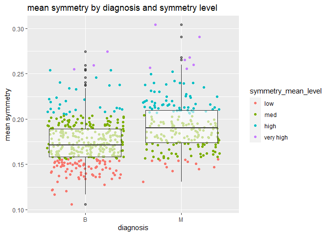

Mini Data Analysis Milestone 2
================

*To complete this milestone, you can either edit [this `.rmd`
file](https://raw.githubusercontent.com/UBC-STAT/stat545.stat.ubc.ca/master/content/mini-project/mini-project-2.Rmd)
directly. Fill in the sections that are commented out with
`<!--- start your work here--->`. When you are done, make sure to knit
to an `.md` file by changing the output in the YAML header to
`github_document`, before submitting a tagged release on canvas.*

# Welcome to the rest of your mini data analysis project!

In Milestone 1, you explored your data. and came up with research
questions. This time, we will finish up our mini data analysis and
obtain results for your data by:

- Making summary tables and graphs
- Manipulating special data types in R: factors and/or dates and times.
- Fitting a model object to your data, and extract a result.
- Reading and writing data as separate files.

We will also explore more in depth the concept of *tidy data.*

**NOTE**: The main purpose of the mini data analysis is to integrate
what you learn in class in an analysis. Although each milestone provides
a framework for you to conduct your analysis, it’s possible that you
might find the instructions too rigid for your data set. If this is the
case, you may deviate from the instructions – just make sure you’re
demonstrating a wide range of tools and techniques taught in this class.

# Instructions

**To complete this milestone**, edit [this very `.Rmd`
file](https://raw.githubusercontent.com/UBC-STAT/stat545.stat.ubc.ca/master/content/mini-project/mini-project-2.Rmd)
directly. Fill in the sections that are tagged with
`<!--- start your work here--->`.

**To submit this milestone**, make sure to knit this `.Rmd` file to an
`.md` file by changing the YAML output settings from
`output: html_document` to `output: github_document`. Commit and push
all of your work to your mini-analysis GitHub repository, and tag a
release on GitHub. Then, submit a link to your tagged release on canvas.

**Points**: This milestone is worth 50 points: 45 for your analysis, and
5 for overall reproducibility, cleanliness, and coherence of the Github
submission.

**Research Questions**: In Milestone 1, you chose two research questions
to focus on. Wherever realistic, your work in this milestone should
relate to these research questions whenever we ask for justification
behind your work. In the case that some tasks in this milestone don’t
align well with one of your research questions, feel free to discuss
your results in the context of a different research question.

# Learning Objectives

By the end of this milestone, you should:

- Understand what *tidy* data is, and how to create it using `tidyr`.
- Generate a reproducible and clear report using R Markdown.
- Manipulating special data types in R: factors and/or dates and times.
- Fitting a model object to your data, and extract a result.
- Reading and writing data as separate files.

# Setup

Begin by loading your data and the tidyverse package below:

``` r
library(datateachr) # <- might contain the data you picked!
library(tidyverse)
```

# Task 1: Process and summarize your data

From milestone 1, you should have an idea of the basic structure of your
dataset (e.g. number of rows and columns, class types, etc.). Here, we
will start investigating your data more in-depth using various data
manipulation functions.

### 1.1 (1 point)

First, write out the 4 research questions you defined in milestone 1
were. This will guide your work through milestone 2:

<!-------------------------- Start your work below ---------------------------->

1.  Is there any relationship between diagnosis and mean symmetry?
2.  What is the distribution of worst radius by diagnosis?
3.  Is the probability distribution different in worst concavity and
    mean concavity?
4.  Is it meaningful to combine worst radius, worst concavity, and the
    current findings to make a more accurate diagnosis?
    <!----------------------------------------------------------------------------->

Here, we will investigate your data using various data manipulation and
graphing functions.

### 1.2 (8 points)

Now, for each of your four research questions, choose one task from
options 1-4 (summarizing), and one other task from 4-8 (graphing). You
should have 2 tasks done for each research question (8 total). Make sure
it makes sense to do them! (e.g. don’t use a numerical variables for a
task that needs a categorical variable.). Comment on why each task helps
(or doesn’t!) answer the corresponding research question.

Ensure that the output of each operation is printed!

Also make sure that you’re using dplyr and ggplot2 rather than base R.
Outside of this project, you may find that you prefer using base R
functions for certain tasks, and that’s just fine! But part of this
project is for you to practice the tools we learned in class, which is
dplyr and ggplot2.

**Summarizing:**

1.  Compute the *range*, *mean*, and *two other summary statistics* of
    **one numerical variable** across the groups of **one categorical
    variable** from your data.
2.  Compute the number of observations for at least one of your
    categorical variables. Do not use the function `table()`!
3.  Create a categorical variable with 3 or more groups from an existing
    numerical variable. You can use this new variable in the other
    tasks! *An example: age in years into “child, teen, adult, senior”.*
4.  Compute the proportion and counts in each category of one
    categorical variable across the groups of another categorical
    variable from your data. Do not use the function `table()`!

**Graphing:**

6.  Create a graph of your choosing, make one of the axes logarithmic,
    and format the axes labels so that they are “pretty” or easier to
    read.
7.  Make a graph where it makes sense to customize the alpha
    transparency.

Using variables and/or tables you made in one of the “Summarizing”
tasks:

8.  Create a graph that has at least two geom layers.
9.  Create 3 histograms, with each histogram having different sized
    bins. Pick the “best” one and explain why it is the best.

Make sure it’s clear what research question you are doing each operation
for!

<!------------------------- Start your work below ----------------------------->

#### 1. Is there any relationship between diagnosis and mean symmetry? **(Option 3, 7, 8)**

``` r
cancer_symmetry <- cancer_sample %>%
  mutate(symmetry_mean_level = cut_interval(symmetry_mean, 4, labels = c('low', 'med', 'high', 'very high'))) %>%
  select(diagnosis, symmetry_mean, symmetry_mean_level)
cancer_symmetry
```

    ## # A tibble: 569 × 3
    ##    diagnosis symmetry_mean symmetry_mean_level
    ##    <chr>             <dbl> <fct>              
    ##  1 M                 0.242 high               
    ##  2 M                 0.181 med                
    ##  3 M                 0.207 high               
    ##  4 M                 0.260 very high          
    ##  5 M                 0.181 med                
    ##  6 M                 0.209 high               
    ##  7 M                 0.179 med                
    ##  8 M                 0.220 high               
    ##  9 M                 0.235 high               
    ## 10 M                 0.203 med                
    ## # ℹ 559 more rows

As we can see in the table, the variable “symmetry_mean” is cut into
four categories from low to very high. With the categorized mean
symmetry, we can easily inform the patient of the level instead of
number which the patient has no idea about **(Option 3)**. Then, we can
forward the data to plot and see if there is any relation between
diagnosis and mean symmetry **(Option 7 and Option 8)**.

``` r
cancer_symmetry %>%
  ggplot(aes(x = diagnosis, y = symmetry_mean)) +
  geom_jitter(aes(color = symmetry_mean_level)) + # Add jitter colored by mean symmetry level
  geom_boxplot(alpha = 0.6) + # add box plot with 0.6 transparency to show the covered points
  ggtitle("mean symmetry by diagnosis and symmetry level")+
  xlab("diagnosis") +
  ylab("mean symmetry")
```

<!-- --> In
this plot, malignant masses tend to have higher mean symmetry. 50%
malignant masses have higher mean symmetry than 75% of benign
masses.However, the difference of the distribution is not sufficient for
diagnosis. The mean symmetry can only be used as a support mean for
diagnosis.

#### 2. What is the distribution of worst radius by diagnosis **(Option 1, 6, 8)**?

``` r
#Option 1
summarised_worst_radius <- cancer_sample %>%
  select(radius_worst, diagnosis) %>% # we want to compute the summary statistics of worst radius across diagnosis
  group_by(diagnosis) %>%
  summarise(mean = mean(radius_worst, na.rm = TRUE), range = range(radius_worst, na.rm = TRUE), std = sd(radius_worst, na.rm = TRUE), quantile = quantile(radius_worst, 0.75, na.rm = TRUE)) # calculate mean, range, standard deviation and 3rd quantile
```

    ## Warning: Returning more (or less) than 1 row per `summarise()` group was deprecated in
    ## dplyr 1.1.0.
    ## ℹ Please use `reframe()` instead.
    ## ℹ When switching from `summarise()` to `reframe()`, remember that `reframe()`
    ##   always returns an ungrouped data frame and adjust accordingly.
    ## Call `lifecycle::last_lifecycle_warnings()` to see where this warning was
    ## generated.

    ## `summarise()` has grouped output by 'diagnosis'. You can override using the
    ## `.groups` argument.

``` r
summarised_worst_radius
```

    ## # A tibble: 4 × 5
    ## # Groups:   diagnosis [2]
    ##   diagnosis  mean range   std quantile
    ##   <chr>     <dbl> <dbl> <dbl>    <dbl>
    ## 1 B          13.4  7.93  1.98     14.8
    ## 2 B          13.4 19.8   1.98     14.8
    ## 3 M          21.1 12.8   4.28     23.8
    ## 4 M          21.1 36.0   4.28     23.8

The malignant masses have obviously higher mean, standard deviation, and
3rd quantile of worst radius than benign masses. The range of worst
radius differs a lot between malignant masses and benign masses. I
believe that the worst radius can help diagnosis and it should align
with the mean radius. To show it, we can plot it as following **(Option
6 and Option 8)**:

``` r
cancer_sample %>%
  ggplot(aes(x = radius_worst, y = radius_mean)) +
  geom_point(aes(color = diagnosis)) + # use point plot to show the strong relationship
  geom_smooth(method='lm')+
  scale_x_log10() + #add log10 for better visualization
  ggtitle("mean radius against worst radius by diagnosis") +
  xlab("worst radius (scaled log10)") +
  ylab("mean radius")
```

    ## `geom_smooth()` using formula = 'y ~ x'

<!-- --> The
plot shows a strong positive relationship between mean and worst radius
which aligns with our findings in project 1. The worst radius with mean
radius can help a lot in diagnosis.

#### 3. Is the probability distribution different in worst concavity and mean concavity? (Option 1, 2, 9)

We have already seen the significance of mean concavity in last project.
To perform a similar analysis as worst radius, I would like to see the
summary statistics of worst concavity first. **(Option 1)**

``` r
# Option 1
summarised_worst_concavity <- cancer_sample %>%
  select(concavity_worst, diagnosis) %>% # we want to compute the summary statistics of worst radius across diagnosis
  group_by(diagnosis) %>%
  summarise(mean = mean(concavity_worst, na.rm = TRUE), range = range(concavity_worst, na.rm = TRUE), std = sd(concavity_worst, na.rm = TRUE), quantile = quantile(concavity_worst, 0.75, na.rm = TRUE)) # calculate mean, range, standard deviation and 3rd quantile
```

    ## Warning: Returning more (or less) than 1 row per `summarise()` group was deprecated in
    ## dplyr 1.1.0.
    ## ℹ Please use `reframe()` instead.
    ## ℹ When switching from `summarise()` to `reframe()`, remember that `reframe()`
    ##   always returns an ungrouped data frame and adjust accordingly.
    ## Call `lifecycle::last_lifecycle_warnings()` to see where this warning was
    ## generated.

    ## `summarise()` has grouped output by 'diagnosis'. You can override using the
    ## `.groups` argument.

``` r
summarised_worst_concavity
```

    ## # A tibble: 4 × 5
    ## # Groups:   diagnosis [2]
    ##   diagnosis  mean  range   std quantile
    ##   <chr>     <dbl>  <dbl> <dbl>    <dbl>
    ## 1 B         0.166 0      0.140    0.222
    ## 2 B         0.166 1.25   0.140    0.222
    ## 3 M         0.451 0.0240 0.182    0.556
    ## 4 M         0.451 1.17   0.182    0.556

The range has approximately no difference but the mean and 3rd quantile
show the significance. Before we see the distribution, I would like to
have a look at the number of observations of diagnosis to see if it is
evenly distributed **(Option 2)**.

``` r
# Option 2
cancer_sample %>%
  group_by(diagnosis) %>%
  count()  ## count the observations of diagnosis
```

    ## # A tibble: 2 × 2
    ## # Groups:   diagnosis [2]
    ##   diagnosis     n
    ##   <chr>     <int>
    ## 1 B           357
    ## 2 M           212

Apparently, the number of diagnosis is not balanced. Therefore, we
should plot the proportion instead of frequency. I will show three plots
with descending bin width **(Option 9)**.

``` r
cancer_sample %>%
  ggplot(aes(x = concavity_worst, fill = diagnosis)) +
  geom_histogram(aes(y = stat(density)*0.5),binwidth=0.5)+ # plot the proportion of worst concavity
  facet_wrap(facets = ~diagnosis)+ # wrap by diagnosis
  ggtitle("The distribution of worst concavity by diagnosis")+
  xlab("worst concavity")+
  ylab("proportion")
```

    ## Warning: `stat(density)` was deprecated in ggplot2 3.4.0.
    ## ℹ Please use `after_stat(density)` instead.
    ## This warning is displayed once every 8 hours.
    ## Call `lifecycle::last_lifecycle_warnings()` to see where this warning was
    ## generated.

<!-- -->

``` r
cancer_sample %>%
  ggplot(aes(x = concavity_worst, fill = diagnosis)) +
  geom_histogram(aes(y = stat(density) * 0.3),binwidth=0.3)+ # plot the proportion of worst concavity
  facet_wrap(facets = ~diagnosis)+ # wrap by diagnosis
  ggtitle("The distribution of worst concavity by diagnosis")+
  xlab("worst concavity")+
  ylab("proportion")
```

<!-- -->

``` r
cancer_sample %>%
  ggplot(aes(x = concavity_worst, fill = diagnosis)) +
  geom_histogram(aes(y = stat(density) * 0.15),binwidth=0.15)+ # plot the proportion of worst concavity
  facet_wrap(facets = ~diagnosis)+ # wrap by diagnosis
  ggtitle("The distribution of worst concavity by diagnosis")+
  xlab("worst concavity")+
  ylab("proportion")
```

<!-- --> The
0.15 bin width has the best visualization and it shows the clear
difference of distribution. When bin width is 0.15, the distribution
aligns with mean concavity and more malignant masses have larger worst
concavity.

#### 4. Is it meaningful to combine worst radius, worst concavity, and the current findings to make a more accurate diagnosis? (Option 3, 4, 7, 8)

I will first cut the worst radius and the worst concavity into four
categories so that we can combine them together as one dimension “worst
level” for easy diagnosis. The resulted worst_level has 16 categories
from “low low” to “high high”. By combining the two level variables, we
can simulate an easy model for pre-diagnosis, for example, self
diagnosis before seeing a doctor **(Option 3)**. I also calculate the
sum of normalized worst concavity and worst radius as a representation
of numeric worst level for plotting.

``` r
cancer_worst_radius_concavity <- cancer_sample %>%
  mutate(radius_worst_level = cut_interval(radius_worst, 4, labels = c('low', 'med', 'high', 'very high')), concavity_worst_level = cut_interval(concavity_worst, 4, labels = c('low', 'med', 'high', 'very high'))) %>% # cut the worst radius and concavity into four intervals
  mutate(worst_level = paste0(as.character(radius_worst_level)," ", as.character(concavity_worst_level)), worst_value = scale(radius_worst)+scale(concavity_worst)) %>%
  select(diagnosis, worst_level, worst_value)
cancer_worst_radius_concavity
```

    ## # A tibble: 569 × 3
    ##    diagnosis worst_level   worst_value[,1]
    ##    <chr>     <chr>                   <dbl>
    ##  1 M         high high               3.99 
    ##  2 M         high low                1.66 
    ##  3 M         high med                2.36 
    ##  4 M         low high                1.71 
    ##  5 M         high med                1.91 
    ##  6 M         med med                 1.10 
    ##  7 M         high med                1.88 
    ##  8 M         med low                 0.143
    ##  9 M         med med                 1.12 
    ## 10 M         med very high           3.75 
    ## # ℹ 559 more rows

Then we can have a look at the proportion and counts of each worst level
**(Option 4)**:

``` r
cancer_worst_radius_concavity %>%
  group_by(diagnosis, worst_level) %>%
  summarise(counts = n()) %>% # calculate the counts of each worst concavity level
  mutate(proportion = counts / sum(counts)) # calculate the proportion of each worst concavity level
```

    ## `summarise()` has grouped output by 'diagnosis'. You can override using the
    ## `.groups` argument.

    ## # A tibble: 21 × 4
    ## # Groups:   diagnosis [2]
    ##    diagnosis worst_level   counts proportion
    ##    <chr>     <chr>          <int>      <dbl>
    ##  1 B         low high           3    0.00840
    ##  2 B         low low          250    0.700  
    ##  3 B         low med           23    0.0644 
    ##  4 B         low very high      1    0.00280
    ##  5 B         med high           2    0.00560
    ##  6 B         med low           68    0.190  
    ##  7 B         med med           10    0.0280 
    ##  8 M         high high         13    0.0613 
    ##  9 M         high low           7    0.0330 
    ## 10 M         high med          54    0.255  
    ## # ℹ 11 more rows

As we can see in the table, most benign masses lie in “low low” level
while “low low” level is very rare in malignant masses. Therefore, if a
patient is categorized as “low low”, his/her masses are most likely to
be benign. Then, to visualize the result simple model, a plot is shown
**(Option 7 and 8)**

``` r
cancer_worst_radius_concavity %>%
  ggplot(aes(x = diagnosis, y = worst_value)) +
  geom_boxplot()+ # the box plot of worst value by diagnosis
  geom_jitter(aes(color = worst_level), alpha = 0.3)+ # add jitter to show the distribution of worst level
  ggtitle("The boxplot of worst value by diagnosis")+
  xlab("diagnosis")+
  ylab("worst value")
```

<!-- --> The
plot suggests a clear difference between the diagnosis. Most benign
masses have worst values below 0 and worst level in “low low” and “med
low” while most malignant masses have worst values above 1 and diverse
worst level in “high” pattern.

*Thus, our simple model combined the worst radius and the worst
concavity further increases the variance of data between benign and
malignant masses. Our “worst level” and “worst value” will help the
diagnosis significantly*.

<!----------------------------------------------------------------------------->

### 1.3 (2 points)

Based on the operations that you’ve completed, how much closer are you
to answering your research questions? Think about what aspects of your
research questions remain unclear. Can your research questions be
refined, now that you’ve investigated your data a bit more? Which
research questions are yielding interesting results?

<!------------------------- Write your answer here ---------------------------->

Most of my answers are very close to the research questions. I modeled a
simple value to further increase the variance of diagnosis data which
can be used to help diagnosis. However, there are aspects needing more
investigation and the first question shows weak relationship between
mean symmetry and diagnosis. Combining more relevant data or categories
with strong relationship with diagnosis may help. It also concerns me
that the data could be simple and biased that makes my analysis/model
too optimistic. Most of the questions can be refined to describe density
or proportion because the diagnosis data is not balanced which makes the
distribution of count is not balanced. At last, the fourth question
about combining two worst variables enlarges the difference of data
between the two types of diagnosis. The enlarged difference can help the
diagnosis and indicates by looking at both the worst radius and the
worst concavity, the diagnosis is more accurate.

<!----------------------------------------------------------------------------->

# Task 2: Tidy your data

In this task, we will do several exercises to reshape our data. The goal
here is to understand how to do this reshaping with the `tidyr` package.

A reminder of the definition of *tidy* data:

- Each row is an **observation**
- Each column is a **variable**
- Each cell is a **value**

### 2.1 (2 points)

Based on the definition above, can you identify if your data is tidy or
untidy? Go through all your columns, or if you have \>8 variables, just
pick 8, and explain whether the data is untidy or tidy.

<!--------------------------- Start your work below --------------------------->

I choose: diagnosis, worst radius, worst concavity, worst texture, worst
smoothness, mean radius, mean concavity, and mean smoothness. They are
more related to my previous analysis.

``` r
cancer_sample_8 <- cancer_sample %>%
  select(diagnosis, radius_worst, concavity_worst, texture_worst, smoothness_worst, radius_mean, concavity_mean, smoothness_mean)
head(cancer_sample_8)
```

    ## # A tibble: 6 × 8
    ##   diagnosis radius_worst concavity_worst texture_worst smoothness_worst
    ##   <chr>            <dbl>           <dbl>         <dbl>            <dbl>
    ## 1 M                 25.4           0.712          17.3            0.162
    ## 2 M                 25.0           0.242          23.4            0.124
    ## 3 M                 23.6           0.450          25.5            0.144
    ## 4 M                 14.9           0.687          26.5            0.210
    ## 5 M                 22.5           0.4            16.7            0.137
    ## 6 M                 15.5           0.536          23.8            0.179
    ## # ℹ 3 more variables: radius_mean <dbl>, concavity_mean <dbl>,
    ## #   smoothness_mean <dbl>

``` r
sum(is.na(cancer_sample_8))
```

    ## [1] 0

``` r
cancer_sample_8 %>% select(diagnosis) %>% unique()
```

    ## # A tibble: 2 × 1
    ##   diagnosis
    ##   <chr>    
    ## 1 M        
    ## 2 B

``` r
cancer_sample_8 %>%
   select(where(~ all(is.numeric(.)))) %>%
  ncol()
```

    ## [1] 7

1.  diagnosis: if the diagnosis is M (malignant) or B (benign)
2.  radius_worst: the worst radius value of the observation (mass)
3.  concavity_worst: the worst concavity value of the observation (mass)
4.  texture_worst: the worst texture value of the observation (mass)
5.  smoothness_worst: the worst smoothness value of the observation
    (mass)
6.  radius_mean: the mean radius value of the observation (mass)
7.  concavity_mean: the mean concavity value of the observation (mass)
8.  smoothness_mean: the mean smoothness value of the observation (mass)
    We have no na values in the table. The diagnosis contains only two
    categories: M and B. The rest of the variables are all numeric.
    According to the names and descriptions of these variables, each
    column is a variable and each cell is a value. Each row is an
    observation (case) of multiple values. The variables are about the
    radius, concavity, texture and smoothness. Thus, the data is tidy.

<!----------------------------------------------------------------------------->

### 2.2 (4 points)

Now, if your data is tidy, untidy it! Then, tidy it back to it’s
original state.

If your data is untidy, then tidy it! Then, untidy it back to it’s
original state.

Be sure to explain your reasoning for this task. Show us the “before”
and “after”.

<!--------------------------- Start your work below --------------------------->

#### untidy the data

``` r
cancer_sample_8_untidy <- cancer_sample_8 %>%
  unite("radius", radius_mean, radius_worst, sep = " ") %>%
  unite("concavity", concavity_mean, concavity_worst, sep = " ") %>%
  unite("smoothness", smoothness_mean, smoothness_worst, sep = " ") %>%
  select(diagnosis, radius, concavity, smoothness, texture_worst)
head(cancer_sample_8_untidy)
```

    ## # A tibble: 6 × 5
    ##   diagnosis radius      concavity     smoothness     texture_worst
    ##   <chr>     <chr>       <chr>         <chr>                  <dbl>
    ## 1 M         17.99 25.38 0.3001 0.7119 0.1184 0.1622           17.3
    ## 2 M         20.57 24.99 0.0869 0.2416 0.08474 0.1238          23.4
    ## 3 M         19.69 23.57 0.1974 0.4504 0.1096 0.1444           25.5
    ## 4 M         11.42 14.91 0.2414 0.6869 0.1425 0.2098           26.5
    ## 5 M         20.29 22.54 0.198 0.4     0.1003 0.1374           16.7
    ## 6 M         12.45 15.47 0.1578 0.5355 0.1278 0.1791           23.8

I concatenate the mean and worst for radius, concavity, and smoothness
together. The resulted data is not numeric and hard to analysis. To tidy
the data, we have to separate the radius, concavity, and smoothness into
mean and worst accordingly so that each cell is a number.

#### tidy the data

Since I merged the columns, I will then split them.

``` r
cancer_sample_8_tidy <- cancer_sample_8_untidy %>% 
  separate("radius", into = c("radius_mean", "radius_worst"), sep = " ") %>% #split the data
  separate("concavity", into = c("concavity_mean", "concavity_worst"), sep = " ") %>%
  separate("smoothness", into = c("smoothness_mean", "smoothness_worst"), sep = " ")
cancer_sample_8_tidy[, 2:8] <- sapply(cancer_sample_8_tidy[, 2:8], as.numeric) # convert the char to numeric of non diagnosis variables
head(cancer_sample_8_tidy)
```

    ## # A tibble: 6 × 8
    ##   diagnosis radius_mean radius_worst concavity_mean concavity_worst
    ##   <chr>           <dbl>        <dbl>          <dbl>           <dbl>
    ## 1 M                18.0         25.4         0.300            0.712
    ## 2 M                20.6         25.0         0.0869           0.242
    ## 3 M                19.7         23.6         0.197            0.450
    ## 4 M                11.4         14.9         0.241            0.687
    ## 5 M                20.3         22.5         0.198            0.4  
    ## 6 M                12.4         15.5         0.158            0.536
    ## # ℹ 3 more variables: smoothness_mean <dbl>, smoothness_worst <dbl>,
    ## #   texture_worst <dbl>

After the splitting, I found the data types of the split variables are
char. Then I convert them into numeric again. Finally, the resulted
table is the same as the original tidy table regardless of the order or
variables.

<!----------------------------------------------------------------------------->

### 2.3 (4 points)

Now, you should be more familiar with your data, and also have made
progress in answering your research questions. Based on your interest,
and your analyses, pick 2 of the 4 research questions to continue your
analysis in the remaining tasks:

<!-------------------------- Start your work below ---------------------------->

1.  What is the distribution of worst radius by diagnosis?
2.  Is it meaningful to combine worst radius, worst concavity, and the
    current findings to make a more accurate diagnosis?

<!----------------------------------------------------------------------------->

Explain your decision for choosing the above two research questions.

<!--------------------------- Start your work below --------------------------->

1.  The first question has a result that aligns with my findings in
    project 1. Therefore the radius is more significant during the
    diagnosis.
2.  The second question leads to a finding that combining worst radius
    and concavity makes the distribution of “worst level/value” more
    separated between malignant and benign masses.
    <!----------------------------------------------------------------------------->

Now, try to choose a version of your data that you think will be
appropriate to answer these 2 questions. Use between 4 and 8 functions
that we’ve covered so far (i.e. by filtering, cleaning, tidy’ing,
dropping irrelevant columns, etc.).

(If it makes more sense, then you can make/pick two versions of your
data, one for each research question.)

<!--------------------------- Start your work below --------------------------->

#### First, extract the diagnosis for each ID

``` r
cancer_diagnosis <- cancer_sample %>%
  select(ID, diagnosis)
head(cancer_diagnosis)
```

    ## # A tibble: 6 × 2
    ##         ID diagnosis
    ##      <dbl> <chr>    
    ## 1   842302 M        
    ## 2   842517 M        
    ## 3 84300903 M        
    ## 4 84348301 M        
    ## 5 84358402 M        
    ## 6   843786 M

#### For first question, we need the radius data and diagnosis data. The primary key (ID) should be included for join

``` r
cancer_radius <- cancer_sample %>%
  select(ID, radius_mean, radius_worst)
head(cancer_radius)
```

    ## # A tibble: 6 × 3
    ##         ID radius_mean radius_worst
    ##      <dbl>       <dbl>        <dbl>
    ## 1   842302        18.0         25.4
    ## 2   842517        20.6         25.0
    ## 3 84300903        19.7         23.6
    ## 4 84348301        11.4         14.9
    ## 5 84358402        20.3         22.5
    ## 6   843786        12.4         15.5

#### For the second question, we have to generate four intervals for worst radius and worst concavity. ID should be included as well.

``` r
cancer_level <- cancer_sample %>%
  mutate(radius_worst_level = cut_interval(radius_worst, 4, labels = c('low', 'med', 'high', 'very high')), concavity_worst_level = cut_interval(concavity_worst, 4, labels = c('low', 'med', 'high', 'very high'))) %>% # cut the worst radius and concavity into four intervals
  mutate(worst_level = paste0(as.character(radius_worst_level)," ", as.character(concavity_worst_level)), worst_value = scale(radius_worst)+scale(concavity_worst)) %>%
  select(ID, worst_level, worst_value)
head(cancer_level)
```

    ## # A tibble: 6 × 3
    ##         ID worst_level worst_value[,1]
    ##      <dbl> <chr>                 <dbl>
    ## 1   842302 high high              3.99
    ## 2   842517 high low               1.66
    ## 3 84300903 high med               2.36
    ## 4 84348301 low high               1.71
    ## 5 84358402 high med               1.91
    ## 6   843786 med med                1.10

When we need to combine the two questions together, we can then join
them by ID:

``` r
cancer_final <- cancer_radius %>%
  inner_join(cancer_level, by = 'ID') %>%
  inner_join(cancer_diagnosis, by = 'ID') %>%
  select(ID, diagnosis, everything())
head(cancer_final)
```

    ## # A tibble: 6 × 6
    ##         ID diagnosis radius_mean radius_worst worst_level worst_value[,1]
    ##      <dbl> <chr>           <dbl>        <dbl> <chr>                 <dbl>
    ## 1   842302 M                18.0         25.4 high high              3.99
    ## 2   842517 M                20.6         25.0 high low               1.66
    ## 3 84300903 M                19.7         23.6 high med               2.36
    ## 4 84348301 M                11.4         14.9 low high               1.71
    ## 5 84358402 M                20.3         22.5 high med               1.91
    ## 6   843786 M                12.4         15.5 med med                1.10

# Task 3: Modelling

## 3.0 (no points)

Pick a research question from 1.2, and pick a variable of interest
(we’ll call it “Y”) that’s relevant to the research question. Indicate
these.

<!-------------------------- Start your work below ---------------------------->

**Research Question**: Is it meaningful to combine worst radius, worst
concavity, and the current findings to make a more accurate diagnosis?

**Variable of interest**: worst value

<!----------------------------------------------------------------------------->

## 3.1 (3 points)

Fit a model or run a hypothesis test that provides insight on this
variable with respect to the research question. Store the model object
as a variable, and print its output to screen. We’ll omit having to
justify your choice, because we don’t expect you to know about model
specifics in STAT 545.

- **Note**: It’s OK if you don’t know how these models/tests work. Here
  are some examples of things you can do here, but the sky’s the limit.

  - You could fit a model that makes predictions on Y using another
    variable, by using the `lm()` function.
  - You could test whether the mean of Y equals 0 using `t.test()`, or
    maybe the mean across two groups are different using `t.test()`, or
    maybe the mean across multiple groups are different using `anova()`
    (you may have to pivot your data for the latter two).
  - You could use `lm()` to test for significance of regression
    coefficients.

<!-------------------------- Start your work below ---------------------------->

``` r
ttest <- t.test(worst_value~diagnosis, data = cancer_final) # t test of worst value of two groups (M and B)
ttest
```

    ## 
    ##  Welch Two Sample t-test
    ## 
    ## data:  worst_value by diagnosis
    ## t = -29.454, df = 314.31, p-value < 2.2e-16
    ## alternative hypothesis: true difference in means between group B and group M is not equal to 0
    ## 95 percent confidence interval:
    ##  -3.165813 -2.769342
    ## sample estimates:
    ## mean in group B mean in group M 
    ##       -1.105670        1.861907

There is a significant difference in means of two types of diagnosis.

<!----------------------------------------------------------------------------->

## 3.2 (3 points)

Produce something relevant from your fitted model: either predictions on
Y, or a single value like a regression coefficient or a p-value.

- Be sure to indicate in writing what you chose to produce.
- Your code should either output a tibble (in which case you should
  indicate the column that contains the thing you’re looking for), or
  the thing you’re looking for itself.
- Obtain your results using the `broom` package if possible. If your
  model is not compatible with the broom function you’re needing, then
  you can obtain your results by some other means, but first indicate
  which broom function is not compatible.

<!-------------------------- Start your work below ---------------------------->

``` r
library(broom)
```

#### I will show the p value from the t test above.

``` r
result <- tidy(ttest)
pvalue <- result %>% select(p.value)
pvalue
```

    ## # A tibble: 1 × 1
    ##    p.value
    ##      <dbl>
    ## 1 2.11e-92

<!----------------------------------------------------------------------------->

# Task 4: Reading and writing data

Get set up for this exercise by making a folder called `output` in the
top level of your project folder / repository. You’ll be saving things
there.

## 4.1 (3 points)

Take a summary table that you made from Task 1, and write it as a csv
file in your `output` folder. Use the `here::here()` function.

- **Robustness criteria**: You should be able to move your Mini Project
  repository / project folder to some other location on your computer,
  or move this very Rmd file to another location within your project
  repository / folder, and your code should still work.
- **Reproducibility criteria**: You should be able to delete the csv
  file, and remake it simply by knitting this Rmd file.

<!-------------------------- Start your work below ---------------------------->

``` r
library(here)
```

    ## here() starts at C:/Users/37919/Documents/STAT 545/mda/mda-BearAlenko

``` r
summarised_worst_radius
```

    ## # A tibble: 4 × 5
    ## # Groups:   diagnosis [2]
    ##   diagnosis  mean range   std quantile
    ##   <chr>     <dbl> <dbl> <dbl>    <dbl>
    ## 1 B          13.4  7.93  1.98     14.8
    ## 2 B          13.4 19.8   1.98     14.8
    ## 3 M          21.1 12.8   4.28     23.8
    ## 4 M          21.1 36.0   4.28     23.8

``` r
write_csv(summarised_worst_radius, file = here("output", "summarised_worst_radius.csv"))
```

<!----------------------------------------------------------------------------->

## 4.2 (3 points)

Write your model object from Task 3 to an R binary file (an RDS), and
load it again. Be sure to save the binary file in your `output` folder.
Use the functions `saveRDS()` and `readRDS()`.

- The same robustness and reproducibility criteria as in 4.1 apply here.

<!-------------------------- Start your work below ---------------------------->

``` r
saveRDS(ttest, file = here("output", "ttest.rds"))
readRDS(here("output", "ttest.rds"))
```

    ## 
    ##  Welch Two Sample t-test
    ## 
    ## data:  worst_value by diagnosis
    ## t = -29.454, df = 314.31, p-value < 2.2e-16
    ## alternative hypothesis: true difference in means between group B and group M is not equal to 0
    ## 95 percent confidence interval:
    ##  -3.165813 -2.769342
    ## sample estimates:
    ## mean in group B mean in group M 
    ##       -1.105670        1.861907

<!----------------------------------------------------------------------------->

# Overall Reproducibility/Cleanliness/Coherence Checklist

Here are the criteria we’re looking for.

## Coherence (0.5 points)

The document should read sensibly from top to bottom, with no major
continuity errors.

The README file should still satisfy the criteria from the last
milestone, i.e. it has been updated to match the changes to the
repository made in this milestone.

## File and folder structure (1 points)

You should have at least three folders in the top level of your
repository: one for each milestone, and one output folder. If there are
any other folders, these are explained in the main README.

Each milestone document is contained in its respective folder, and
nowhere else.

Every level-1 folder (that is, the ones stored in the top level, like
“Milestone1” and “output”) has a `README` file, explaining in a sentence
or two what is in the folder, in plain language (it’s enough to say
something like “This folder contains the source for Milestone 1”).

## Output (1 point)

All output is recent and relevant:

- All Rmd files have been `knit`ted to their output md files.
- All knitted md files are viewable without errors on Github. Examples
  of errors: Missing plots, “Sorry about that, but we can’t show files
  that are this big right now” messages, error messages from broken R
  code
- All of these output files are up-to-date – that is, they haven’t
  fallen behind after the source (Rmd) files have been updated.
- There should be no relic output files. For example, if you were
  knitting an Rmd to html, but then changed the output to be only a
  markdown file, then the html file is a relic and should be deleted.

Our recommendation: delete all output files, and re-knit each
milestone’s Rmd file, so that everything is up to date and relevant.

## Tagged release (0.5 point)

You’ve tagged a release for Milestone 2.

### Attribution

Thanks to Victor Yuan for mostly putting this together.
